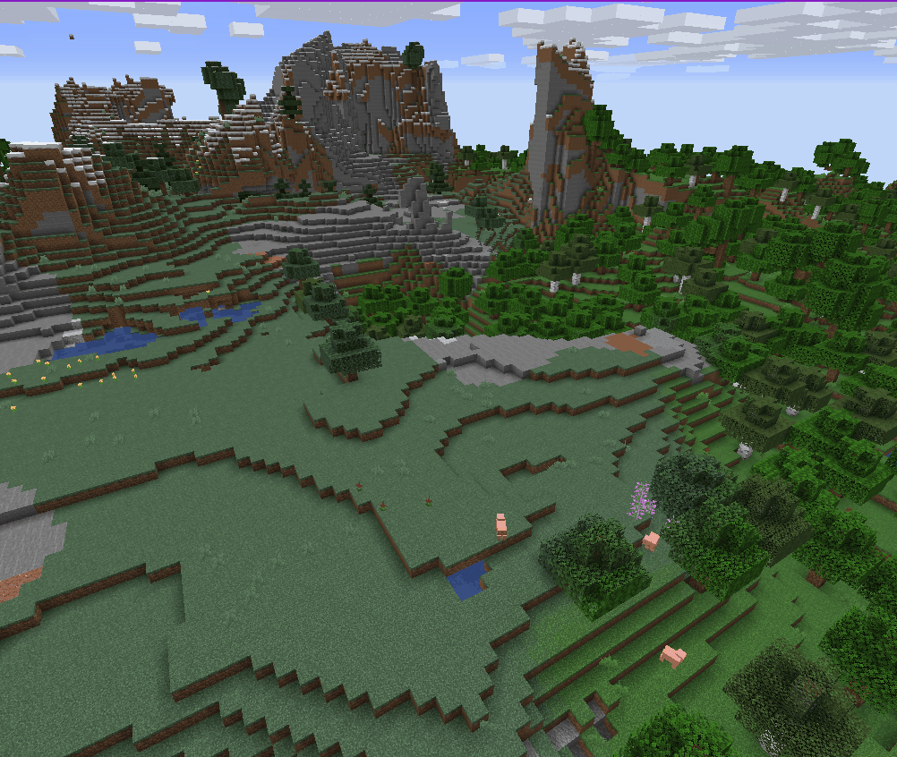

# A training project for the GDMC Competition

### Goals :
1. Understand the environment (gdmc http mod + python)
2. Try to generate something
3. Do cool stuff

### Heightmap in Real Time 

### Simple generation

#### Goal : Place little 'houses' consisting of a wooden cube with a door.
Their size is defined randomly between 5 and 15 blocs for each wall.
The size of the generation area is 100 by 100
It does not take into account leaves, water, or structures' orientation
